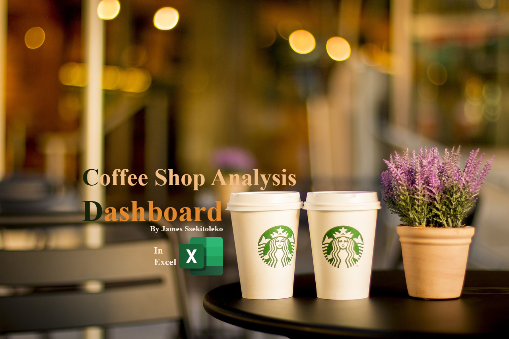
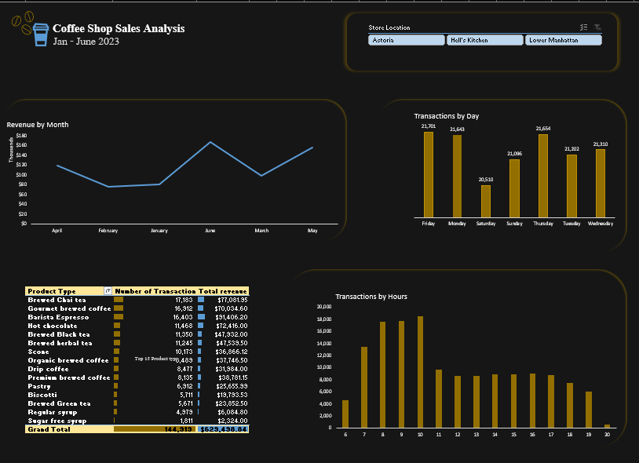

# COFFEE SHOP SALES EXCEL ANALYSIS

### The primary goals of this project were to:
Analyze transaction data to identify key trends and patterns in sales and transactions.
Determine the performance of different product categories and individual products.
Optimize operations by understanding peak transaction times and high-revenue periods.
Provide actionable insights to improve overall business efficiency and sales strategies.
Business Needs:
The coffee shop required a detailed analysis of their sales data to:

Enhance decision-making processes with data-driven insights.

Optimize staff scheduling by identifying peak hours and busy days.

Tailor inventory management based on the popularity of products.

Develop targeted marketing strategies to boost sales during off-peak times.

## Discovering and Presenting Insights:
### To meet these needs, the project involved several key steps:

Data Preparation and Quality Assurance:

Conducted initial data profiling and quality checks to ensure accuracy and completeness.

I added calculated fields for revenue, month, day of the week, and hour of the day.

### Creating PivotTables:

Generated pivot tables to summarize revenue by month, transactions by day of the week and hour, and transactions by product category.
Sorted and filtered data to highlight the top 15 product types by the number of transactions and revenue.
pivot tables

# Visualization and Dashboard Development
 
Created Pivot Charts to visually represent revenue trends by month, transaction patterns by day and hour, and product category performance.

Assembled the charts into a cohesive dashboard layout for easy interpretation.

Added slicers for store locations to enable dynamic filtering across all PivotTables.

### Insights and Recommendations:

Identified peak transaction times and days to optimize staffing and inventory levels.

Highlighted high-performing products and categories to inform promotional strategies.

Suggested targeted marketing during off-peak periods to boost overall sales.

By leveraging Excel's powerful data analysis and visualization capabilities, this project provided the coffee shop with a comprehensive overview of their sales and transaction performance, enabling informed decision-making and strategic improvements.
